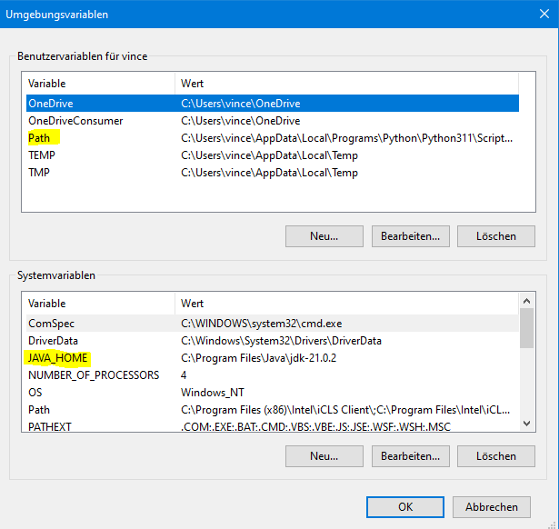

# JDK-21 and Maven Apache
## Prerequisites
* IDE (i.e. Intellij)
* JDK (preferable up2date version)
* Apache Maven (version that best suits the installed JDK)
   + [Use website to check](https://whichjdk.com/)
### Here is a quick guide to installing both
* Download both binary zip files
  + [JDK-21](https://jdk.java.net/21/) and [Apache Maven](https://maven.apache.org/download.cgi)
  + In the system variable settings, add a new path `JAVA-HOME` that points towards the extracted jdk file.
  + The user variable `Path` should point towards the bin directory of **both** files.

+  Check if both are correctly installed by entering following commands in cmd:
   + `java --version`, `javac -version`
   + `mvn -v`
   + Example output 

### Application
After implementing our methods and running main, we have a new directory in our project: `target`

When we add our blocks for XML, run `mvn compile` in terminal and then `mvn exec:java`

#### Troubleshooting
- When adding the blocks to pom.xml, if the version number is marked red, simply restart your IDE.

