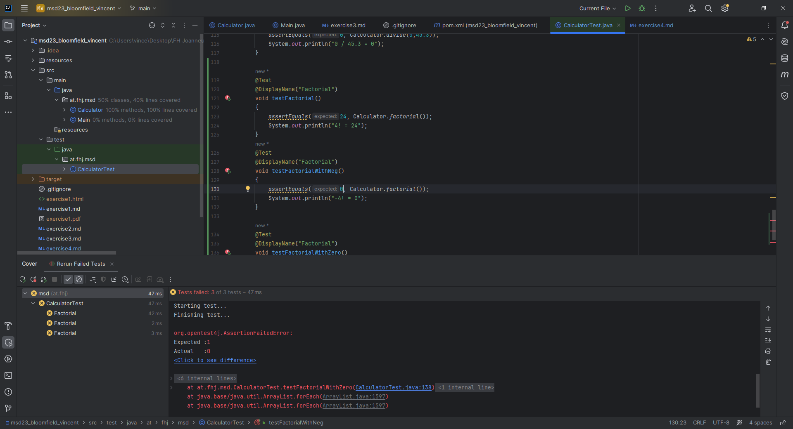

# JUnit Testing
## Prerequisites
Update `pom.xml` with the following
```xml
      <dependency>
            <groupId>org.junit.jupiter</groupId>
            <artifactId>junit-jupiter-api</artifactId>
            <version>5.10.2</version>
            <scope>test</scope>
        </dependency>
        <dependency>
            <groupId>org.junit.jupiter</groupId>
            <artifactId>junit-jupiter-engine</artifactId>
            <version>5.10.2</version>
            <scope>test</scope>
        </dependency>
        <dependency>
            <groupId>org.junit.jupiter</groupId>
            <artifactId>junit-jupiter-params</artifactId>
            <version>5.10.2</version>
            <scope>test</scope>
        </dependency>
```
## Testing
Create `CalculatorTest.java`, where out tests will be written. Be mindful to add `@Test` & `@BeforeEach` annotations  
Example:
```java
    @Test
    @DisplayName("Adds number with negative number")
    void addWithNeg() { }

    @Test
    @DisplayName("Subtracts two numbers")
    void minus() { }

    @Test
    @DisplayName("Subtracts a number with a negative number")
    void minusWithNeg() { }

    @Test
    @DisplayName("Multiplies a number with zero")
    void multiplyZero() { }
    
    @Test
    @DisplayName("Divides zero by a number")
    void divideZero() { }
```
Next step is to `Run with coverage`.  
Example output:

## Factorial Method
For our next step we create a factorial method both in our 'Calculator.java' and our test class 'CalculatorTest.java'.
Without concrete implementation, run with coverage. Result should be this:

To finish off, implement factorial method and test again to make sure all tests pass.
